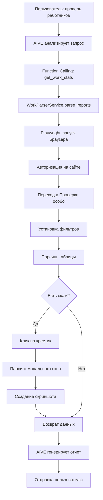

# 🕷️ Парсер отчетов работников

## 📋 Описание

Полная интеграция парсинга веб-панели с отчетами работников (http://91.228.153.202:8000) в Telegram бота AIVE.

**Возможности:**
- 🔐 Автоматическая авторизация на сайте
- 📊 Парсинг таблицы с отчетами работников
- 🚨 Обнаружение скама (красный крестик, желтое предупреждение)
- 📸 Автоматические скриншоты деталей скама
- 🎯 Фильтрация по команде (Good Bunny / Velvet)
- 📅 Фильтрация по дате
- 🤖 Интеграция с AIVE для генерации отчетов

---

## 🚀 Использование

### 1️⃣ **Простой запрос проверки**

Просто пиши AIVE:

```
сделай проверку по работникам
```

```
проверь отчеты за сегодня
```

```
покажи статистику по Good Bunny
```

**AIVE автоматически:**
- Зайдет на сайт
- Спарсит данные
- Проверит на скам
- Сформирует красивый отчет

---

### 2️⃣ **Проверка конкретного работника**

```
что со скамом у Алексея?
```

```
покажи отчет по Ивану
```

```
проверь работника Мария
```

**AIVE:**
- Найдет работника в отчетах
- Если есть скам → откроет модальное окно
- Создаст скриншот
- Отправит детали

---

### 3️⃣ **Фильтрация по дате**

```
проверь работников за вчера
```

```
покажи отчеты за 2025-10-27
```

---

## 📊 Что парсится

Для каждого работника:

```
✅ Имя работника
✅ Username (@nickname)
✅ Команда (Good Bunny / Velvet)
✅ ID отчета
✅ SFS (общее количество)
✅ Only Now (SFS - SCH)
✅ SCH (с расписанием)
✅ Проверка на скам:
   🚨 Красный крестик = СКАМ ОБНАРУЖЕН
   ⚠️ Желтый знак = ПОДОЗРИТЕЛЬНАЯ АКТИВНОСТЬ
   ✅ Зеленая галочка = ЧИСТЫЙ ОТЧЕТ
```

---

## 🎯 Пример отчета от AIVE

```
📊 **Отчет по команде Good Bunny** за 2025-10-28

👥 Работников: 15
📈 SFS: 2450
⏱️ Only Now: 1850
✅ SCH: 600

🚨 **СКАМ ОБНАРУЖЕН**: 2 работник(ов)

⚠️ **Работники со скамом:**
🚨 Alexey (@alexey_work) (SFS: 150, SCH: 50)
⚠️ Maria (@maria_assist) (SFS: 100, SCH: 30)
```

---

## 🔧 Технические детали

### Архитектура

```
services/work_parser_service.py
├── WorkParserService - основной класс парсера
│   ├── _init_browser() - запуск Playwright (headless Chrome)
│   ├── _login() - авторизация на сайте
│   ├── parse_reports() - парсинг таблицы отчетов
│   ├── _parse_worker_row() - парсинг строки работника
│   ├── _parse_scam_details() - парсинг модального окна скама
│   └── get_worker_scam_screenshots() - получение скриншотов
```

### CSS Селекторы

```python
SELECTORS = {
    # Авторизация
    "login_username": "input[name='username']",
    "login_password": "input[name='password']",
    "login_submit": "button[type='submit']",
    
    # Таблица
    "table_rows": "tbody tr",
    "worker_name": "td:nth-child(1) strong",
    "scam_icon_red": "td:nth-child(4) i.bi-x-circle-fill.text-danger",
    "sfs_badge": "td:nth-child(5) .badge",
    
    # И т.д...
}
```

### Playwright - Headless режим

```python
browser = await playwright.chromium.launch(
    headless=True,  # Без GUI
    args=[
        '--no-sandbox',  # Для Linux серверов
        '--disable-setuid-sandbox',
        '--disable-dev-shm-usage',
        '--disable-gpu'
    ]
)
```

---

## 🔐 Настройка

### 1. Переменные окружения (`.env`)

```env
# Рабочий сайт
WORK_SITE_URL=http://91.228.153.202:8000
WORK_SITE_USERNAME=Timofey
WORK_SITE_PASSWORD=admin123
```

### 2. Установка Playwright

```bash
# Установка библиотеки
pip install playwright

# Установка браузеров
playwright install chromium
```

**Для Linux сервера:**

```bash
# Установка зависимостей для headless Chrome
sudo apt-get update
sudo apt-get install -y \
    libnss3 \
    libatk1.0-0 \
    libatk-bridge2.0-0 \
    libcups2 \
    libdrm2 \
    libxkbcommon0 \
    libxcomposite1 \
    libxdamage1 \
    libxrandr2 \
    libgbm1 \
    libasound2
```

---

## 🤖 Интеграция с AIVE

### Function Calling

AIVE использует 2 функции:

#### 1. `get_work_stats` - общая статистика

```json
{
  "name": "get_work_stats",
  "description": "Получить статистику работы с сайта",
  "parameters": {
    "date": "YYYY-MM-DD (опционально)",
    "team": "Good Bunny | Velvet | all"
  }
}
```

#### 2. `check_worker_scam` - проверка работника

```json
{
  "name": "check_worker_scam",
  "description": "Проверить скам у конкретного работника",
  "parameters": {
    "worker_name": "Имя работника",
    "date": "YYYY-MM-DD (опционально)",
    "team": "Good Bunny | Velvet | all"
  }
}
```

---

## 📸 Скриншоты

Все скриншоты сохраняются в:

```
data/screenshots/
├── scam_15516_Alexey_20251028_143022.png
├── scam_15517_Maria_20251028_143045.png
└── ...
```

---

## ⚡ Производительность

- **Запуск браузера**: ~2-3 секунды
- **Авторизация**: ~1-2 секунды
- **Парсинг 10 работников**: ~5-7 секунд
- **Парсинг 50 работников**: ~15-20 секунд
- **Скриншот модального окна**: ~0.5 секунды

**Итого для 15 работников**: ~10-12 секунд ⚡

---

## 🐛 Обработка ошибок

```python
# Все ошибки логируются и возвращаются пользователю
{
  "success": False,
  "error": "Описание ошибки"
}
```

**Типичные ошибки:**
- ❌ Ошибка авторизации (неверный логин/пароль)
- ❌ Таймаут загрузки таблицы (нет интернета)
- ❌ Пустая таблица (нет отчетов за дату)
- ❌ Работник не найден

---

## 🔄 Workflow



---

## 📝 Примеры запросов

### Для AIVE

```
✅ сделай проверку работников
✅ проверь отчеты за сегодня
✅ покажи статистику Good Bunny
✅ есть ли скам у кого-то?
✅ что со скамом у Алексея
✅ проверь работника Мария
✅ отчеты за вчера
✅ статистика по команде Velvet
```

### Прямые команды (опционально)

```
/work_stats
/work_stats Good Bunny
/check_worker Alexey
```

---

## 🎨 Кастомизация

### Изменить фильтры по умолчанию

```python
# services/work_parser_service.py

async def parse_reports(
    self,
    team: str = "Good Bunny",  # ← Измени здесь
    report_date: Optional[str] = None
):
```

### Изменить формат отчета

```python
# services/function_tools.py

async def _get_work_stats(self, user_id: int, args: Dict) -> str:
    # ← Измени формат здесь
    result = f"📊 **Отчет...**"
```

---

## 🚀 Развертывание на Linux сервере

### 1. Установка зависимостей

```bash
# Обновление системы
sudo apt update && sudo apt upgrade -y

# Python и pip
sudo apt install python3 python3-pip -y

# Playwright зависимости
sudo apt-get install -y \
    libnss3 libatk1.0-0 libatk-bridge2.0-0 \
    libcups2 libdrm2 libxkbcommon0 \
    libxcomposite1 libxdamage1 libxrandr2 \
    libgbm1 libasound2
```

### 2. Установка Playwright

```bash
pip install playwright
playwright install chromium
```

### 3. Настройка .env

```bash
nano .env
# Добавь переменные WORK_SITE_*
```

### 4. Запуск бота

```bash
python main.py
```

---

## 📚 Связанные файлы

- `services/work_parser_service.py` - основной парсер
- `services/function_tools.py` - функции для AIVE
- `main.py` - инициализация парсера
- `config.py` - конфигурация (URL, логин, пароль)

---

## ✅ Что реализовано

- ✅ Playwright парсер (headless Chrome)
- ✅ Авторизация на сайте
- ✅ Парсинг таблицы работников
- ✅ Обнаружение скама (красный/желтый/зеленый)
- ✅ Парсинг модального окна с деталями
- ✅ Скриншоты
- ✅ Фильтрация по команде
- ✅ Фильтрация по дате
- ✅ Интеграция с AIVE (Function Calling)
- ✅ Проверка конкретного работника
- ✅ Генерация отчетов
- ✅ Обработка ошибок
- ✅ Логирование

---

## 🔮 Возможные улучшения

1. **Кэширование отчетов** (чтобы не парсить каждый раз)
2. **Уведомления о новом скаме** (проактивно)
3. **Статистика по работникам за период**
4. **Экспорт отчетов в Excel**
5. **Графики и визуализация**

---

## 💡 Советы

1. **На Linux сервере** - используй `systemd` для автозапуска бота
2. **Проверяй логи** - все действия парсера логируются
3. **Скриншоты** - автоматически сохраняются в `data/screenshots/`
4. **Headless режим** - браузер работает без GUI (быстро и легко)

---

## 🎉 Готово!

Теперь AIVE может:
- 🔍 Парсить отчеты работников
- 🚨 Обнаруживать скам
- 📸 Делать скриншоты
- 📊 Генерировать красивые отчеты
- 💬 Отвечать на естественном языке

**Просто напиши:**
> "Айви, сделай проверку по работникам" 🚀

